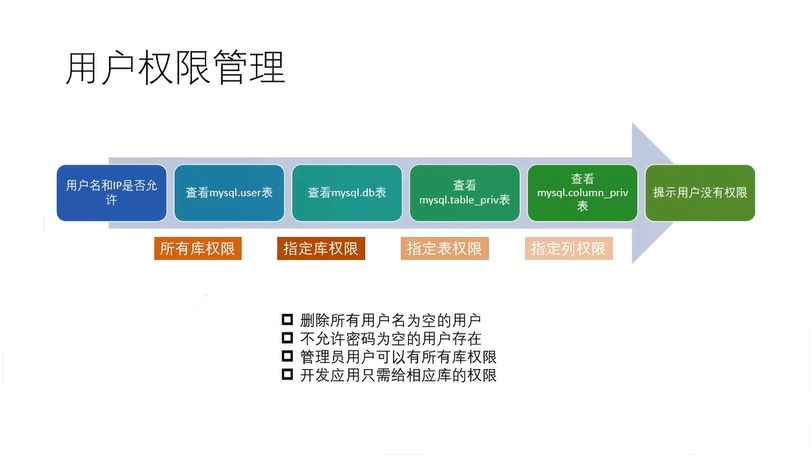
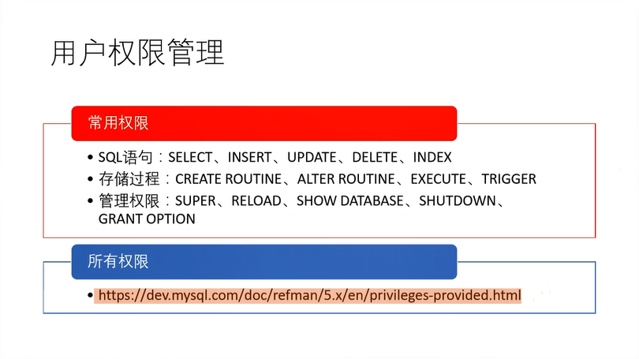

# MySQL的配置文件

* 文件名: my.cnf  (my.ini)
* 文本文件
* 可有多个配置文件
* 参数替换原则

MySQL配置文件的读取顺序：

    shell>>  mysql --help --verbose | grep my.cnf
                      order of preference, my.cnf, $MYSQL_TCP_PORT,
    /etc/my.cnf /etc/mysql/my.cnf /usr/local/mysql/etc/my.cnf ~/.my.cnf

MySQL启动的时候会依次读取以上的配置文件

这就会产生一个问题，如果每个配置文件里面都有同样的参数，则**后面**配置文件中出现的参数会替换掉前面配置文件中的相同参数，即**参数替换原则**

安装MySQL的时候要特别注意这个问题，以免安装后的实际效果不是你想要的那些结果

配置文件常用标签说明：

    [mysqld] # 表示MySQL服务器启动之后使用用到的参数有哪些
    [mysql]  # 表示MySQL命令登录进去之后可配置参数有哪些
    [client] # 表示所有的客户端登录进去使用到的参数有哪些

登录到MySQL之后，查看MySQL所有参数的值：

    (root@localhost) [(none)]> show variables;
    (root@localhost) [(none)]> show variables like 'log_error';
    +---------------+-------------+
    | Variable_name | Value       |
    +---------------+-------------+
    | log_error     | ./error.log |
    +---------------+-------------+
    1 row in set (0.00 sec)
    (root@localhost) [(none)]> show variables like 'innodb%'; # 通配符查询
    (root@localhost) [(none)]> show variables like '%log%'; # 通配符查询
    (root@localhost) [(none)]> show variables like 'datadir'; # 查看数据目录

参数很多，记住重点值即可，MySQL每个参数是有默认值的：

    shell> mysqld --help --verbose | less

### MySQL配置参数

* 从作用域上可分为 global 和 session
* 从类型上又可分为可修改和只读参数
* 用户可在线修改非只读参数
* 只读参数只能通过配置文件修改并重启
* 所有参数的修改都不持久化

| 命令                                                             | 说明                         |
| :--------------------------------------------------------------- | :--------------------------- |
| SHOW[GLOBAL \| SESSION] VARIABLES [LIKE 'pattern' \| WHERE expr] | 查看变量，可根据like进行过滤 |
| SET[GLOBAL \| SESSION] VARIABLES = xx                            | 修改global或session的参数    |

会话级别(session)表示的是参数所起到的作用只对我当前的一个连接有效

举例：

    (root@localhost) [(none)]> show variables like 'long%query%'; # 查询慢日志时间阈值
    +-----------------+-----------+
    | Variable_name   | Value     |
    +-----------------+-----------+
    | long_query_time | 10.000000 |
    +-----------------+-----------+
    1 row in set (0.00 sec)

    (root@localhost) [(none)]> set long_query_time = 1.5; # 设置为1.5秒
    Query OK, 0 rows affected (0.00 sec)

    (root@localhost) [(none)]> show variables like 'long%query%';
    +-----------------+----------+
    | Variable_name   | Value    |
    +-----------------+----------+
    | long_query_time | 1.500000 |
    +-----------------+----------+
    1 row in set (0.00 sec)

新打开一个连接执行慢日志参数查询，会发现变量值还是10秒，在新开的连接会话中该值并没有改变
    
    (root@localhost) [(none)]> show variables like 'long%query%'; # 查询慢日志时间阈值
    +-----------------+-----------+
    | Variable_name   | Value     |
    +-----------------+-----------+
    | long_query_time | 10.000000 |
    +-----------------+-----------+
    1 row in set (0.00 sec)

需要注意这样设置只对当前连接有效，上面的 **show variables like 'long%query%';** 相当于 **show session variables like 'long%query%';**

我们可以将 **session** 改成 **global**

    (root@localhost) [(none)]> set long_query_time = 1.5; # 设置为1.5秒
    Query OK, 0 rows affected (0.00 sec)

    (root@localhost) [(none)]> show variables like 'long%query%';
    +-----------------+----------+
    | Variable_name   | Value    |
    +-----------------+----------+
    | long_query_time | 1.500000 |
    +-----------------+----------+
    1 row in set (0.00 sec)

    (root@localhost) [(none)]> show global variables like 'long%query%';
    +-----------------+-----------+
    | Variable_name   | Value     |
    +-----------------+-----------+
    | long_query_time | 10.000000 |
    +-----------------+-----------+
    1 row in set (0.00 sec)

set + global

    (root@localhost) [(none)]> set global long_query_time = 5; # 设置为5秒
    Query OK, 0 rows affected (0.00 sec)

    (root@localhost) [(none)]> show global variables like 'long%query%';
    +-----------------+-----------+
    | Variable_name   | Value     |
    +-----------------+-----------+
    | long_query_time | 5.000000  |
    +-----------------+-----------+
    1 row in set (0.01 sec)

同样 set 加上 global 就会设置全局的值，但是需要注意的是即使使用了 global 进行设置，mysqld 进程重启的话设置还是会回到 10 秒，启动参数需要通过 my.cnf 配置文件进行设置

有些参数在运行的时候是无法进行修改的：

    (root@localhost) [(none)]> set global datadir = '/mdata/q/';
    ERROR 1238 (HY000): Variable 'datadir' is a read only variable # 只读参数

但是如果想查询多会话中配置参数的情况，使用命令行来进行查询就显得不怎么方便了。比如 **show global variables** 能查看全局变量 **show variables** 能查看自己当前会话的变量，看另外会话的变量是看不到的，为此 MySQL 从 5.7 版本 **performance_schema** 数据库中有新增和配置相关的几张数据表，用来查看不同进程（会话）中的配置参数：

    (root@localhost) [(none)]> use performance_schema;
    Database changed
    (root@localhost) [performance_schema]> show tables like '%variables%';
    +--------------------------------------------+
    | Tables_in_performance_schema (%variables%) |
    +--------------------------------------------+
    | global_variables                           |
    | session_variables                          |
    | user_variables_by_thread                   |
    | variables_by_thread                        |
    +--------------------------------------------+
    4 rows in set (0.00 sec)

    # 查看所有会话中 long_query_time 变量的值
    (root@localhost) [performance_schema]> select * from variables_by_thread where variable_name = 'long_query_time';

    +-----------+-----------------+----------------+
    | THREAD_ID | VARIABLE_NAME   | VARIABLE_VALUE |
    +-----------+-----------------+----------------+
    |        27 | long_query_time | 10.000000      |
    |        28 | long_query_time |  5.000000      |
    +-----------+-----------------+----------------+
    1 row in set (0.00 sec)

    # 查看当前内部线程或者外部线程连接到 MySQL 的列表，但是会发现 Id 值和上面的 THREAD_ID 无法对应，这两者不是一个 Id
    (root@localhost) [performance_schema]> show processlist;
    +----+------+-----------+--------------------+---------+------+----------+------------------+
    | Id | User | Host      | db                 | Command | Time | State    | Info             |
    +----+------+-----------+--------------------+---------+------+----------+------------------+
    |  2 | root | localhost | performance_schema | Query   |    0 | starting | show processlist |
    +----+------+-----------+--------------------+---------+------+----------+------------------+
    1 row in set (0.00 sec)

    # 查看当前连接ID
    (root@localhost) [performance_schema]> select connection_id();
    +-----------------+
    | connection_id() |
    +-----------------+
    |               2 | <---- 对应 show processlist 中的那个Id
    +-----------------+
    1 row in set (0.01 sec)

    # MySQL5.7中又推出了一个新的表用来做对映
    (root@localhost) [performance_schema]> select * from threads limit 1\G
    *************************** 1. row ***************************
              THREAD_ID: 1
                   NAME: thread/sql/main
                   TYPE: BACKGROUND
         PROCESSLIST_ID: NULL
       PROCESSLIST_USER: NULL
       PROCESSLIST_HOST: NULL
         PROCESSLIST_DB: NULL
    PROCESSLIST_COMMAND: NULL
       PROCESSLIST_TIME: 2561
      PROCESSLIST_STATE: NULL
       PROCESSLIST_INFO: NULL
       PARENT_THREAD_ID: NULL
                   ROLE: NULL
           INSTRUMENTED: YES
                HISTORY: YES
        CONNECTION_TYPE: NULL
           THREAD_OS_ID: 393
    1 row in set (0.00 sec)

    # 所以查一下THREAD_ID，可以对应的PROCESSLIST_ID为2，这就对上了
    (root@localhost) [performance_schema]> select * from threads where thread_id = 27 limit 1\G
    *************************** 1. row ***************************
              THREAD_ID: 27
                   NAME: thread/sql/one_connection
                   TYPE: FOREGROUND
         PROCESSLIST_ID: 2
       PROCESSLIST_USER: root
       PROCESSLIST_HOST: localhost
         PROCESSLIST_DB: performance_schema
    PROCESSLIST_COMMAND: Query
       PROCESSLIST_TIME: 0
      PROCESSLIST_STATE: Sending data
       PROCESSLIST_INFO: select * from threads where thread_id = 27 limit 1
       PARENT_THREAD_ID: 1
                   ROLE: NULL
           INSTRUMENTED: YES
                HISTORY: YES
        CONNECTION_TYPE: Socket
           THREAD_OS_ID: 423
    1 row in set (0.00 sec)

**THREAD_ID** **PROCESSLIST_ID** **THREAD_OS_ID** 的区别：

* PROCESSLIST_ID MySQL连接的ID，会话的ID
* THREAD_ID 内部线程号
* THREAD_OS_ID 系统线程号

# 用户权限管理

MySQL用户的权限管理由三部分组成，由用户名、密码、IP组成

权限可以分为对全局的权限、对某一个数据库有权限(库级别)、对某张表有权限(表级别)、也可以对指定的列有权限(列级别)

常用权限

* SQL语句：SELECT、INSERT、UPDATE、DELETE、INDEX
* 存储过程：CREATE ROUTINE、ALTER ROUTINE、EXECUTE、TRIGGER
* 管理权限：SUPER、RELOAD、SHOW DATABASE、SHUTDOWN、GRANT OPTION

所有权限

https://dev.mysql.com/doc/refman/5.7/en/privileges-provided.html

## 创建用户

创建一个名为 neo 允许任何 ip 访问 (@''中的为ip地址，如果为 % 表示允许全部 ip 访问) 密码为 123 的用户

    (root@localhost) [none]> create user 'neo'@'%' identified by '123';

用neo这个用户进行连接

    shell> mysql -h127.0.0.1 -uneo -p123

删除用户

    (root@localhost) [none]> drop user 'neo'@'%';
    # 被删除的用户没有退出会话的时候可以继续使用

创建内网用户

    (root@localhost) [none]> create user 'neo'@'192.168.1.%' identified by '123';

## 查看当前用户权限

    (root@localhost) [none]> show grants;
    +---------------------------------------------------------------------+
    | Grants for root@localhost                                           |
    +---------------------------------------------------------------------+
    | GRANT ALL PRIVILEGES ON *.* TO 'root'@'localhost' WITH GRANT OPTION |
    | GRANT PROXY ON ''@'' TO 'root'@'localhost' WITH GRANT OPTION        |
    +---------------------------------------------------------------------+
    2 rows in set (0.00 sec)

查看某个用户权限

    (root@localhost) [none]> show grants for 'neo'@'%';
    +---------------------------------+
    | Grants for neo@%                |
    +---------------------------------+
    | GRANT USAGE ON *.* TO 'neo'@'%' |  <----- USAGE表示基本上只有一个能够连接数据库的权限
    +---------------------------------+
    1 row in set (0.00 sec)

授予增删查改权限，其中 on test.* 点号之前的 test 表示库级权限， 后面的 * 表示表级权限

    (root@localhost) [none]> grant select,update,insert,delete on test.* to 'neo'@'%';
    Query OK, 0 rows affected (0.00 sec)

    (root@localhost) [none]> show grants for 'neo'@'%';
    +---------------------------------------------------------------+
    | Grants for neo@%                                              |
    +---------------------------------------------------------------+
    | GRANT USAGE ON *.* TO 'neo'@'%'                               |
    | GRANT SELECT, INSERT, UPDATE, DELETE ON `test`.* TO 'neo'@'%' |
    +---------------------------------------------------------------+
    2 rows in set (0.00 sec)

修改密码

    (root@localhost) [none]> alter user 'neo'@'%' identified by '456';
    Query OK, 0 rows affected (0.00 sec)

授予创建表、创建索引、修改表权限

    (root@localhost) [none]> grant create,index on test.* to 'neo'@'%';
    Query OK, 0 rows affected (0.00 sec)

    (root@localhost) [none]> show grants for 'neo'@'%';
    +------------------------------------------------------------------------------+
    | Grants for neo@%                                                             |
    +------------------------------------------------------------------------------+
    | GRANT SELECT, INSERT, UPDATE, DELETE ON *.* TO 'neo'@'%'                     |
    | GRANT SELECT, INSERT, UPDATE, DELETE, CREATE, INDEX ON `test`.* TO 'neo'@'%' |
    +------------------------------------------------------------------------------+
    2 rows in set (0.00 sec)

授予所有权限

    (root@localhost) [(none)]> grant all on *.* to 'neo'@'%';

    (root@localhost) [(none)]> show grants for 'neo'@'%';
    +------------------------------------------+
    | Grants for neo@%                         |
    +------------------------------------------+
    | GRANT ALL PRIVILEGES ON *.* TO 'neo'@'%' |
    +------------------------------------------+
    1 row in set (0.00 sec)

删除权限，revoke仅回收权限，不删除用户

    (root@localhost) [none]> revoke create,index on test.* from 'neo'@'%';
    Query OK, 0 rows affected (0.00 sec)

    (root@localhost) [none]> show grants for 'neo'@'%';
    +---------------------------------------------------------------+
    | Grants for neo@%                                              |
    +---------------------------------------------------------------+
    | GRANT USAGE ON *.* TO 'neo'@'%'                               |
    | GRANT SELECT, INSERT, UPDATE, DELETE ON `test`.* TO 'neo'@'%' |
    +---------------------------------------------------------------+
    2 rows in set (0.00 sec)

回收所有权限，revoke仅回收权限，不删除用户

    (root@localhost) [(none)]> revoke all on *.* from 'neo'@'%';
    Query OK, 0 rows affected (0.00 sec)

    (root@localhost) [(none)]> show grants for 'neo'@'%';
    +---------------------------------+
    | Grants for neo@%                |
    +---------------------------------+
    | GRANT USAGE ON *.* TO 'neo'@'%' |
    +---------------------------------+
    1 row in set (0.00 sec)

with grant option 使目标可以将**自身持有的权限**授予给其他用户，也就是说如果没有 with grant option 的权限，你登录了 neo 的账号，想为另一个用户授予权限是做不到的

    (root@localhost) [none]> grant select,update,insert,delete on test.* to 'neo'@'%' with grant option;
    Query OK, 0 rows affected (0.00 sec)

    (root@localhost) [none]> show grants for 'neo'@'%';
    +---------------------------------------------------------------------------------+
    | Grants for neo@%                                                                |
    +---------------------------------------------------------------------------------+
    | GRANT USAGE ON *.* TO 'neo'@'%'                                                 |
    | GRANT SELECT, INSERT, UPDATE, DELETE ON `test`.* TO 'neo'@'%' WITH GRANT OPTION  |
    +---------------------------------------------------------------------------------+
    2 rows in set (0.00 sec)

收回 grant option 权限

    (root@localhost) [(none)]> revoke GRANT OPTION on test.* from 'neo'@'%';
    或者收回所有权限+取消grant option
    (root@localhost) [(none)]> revoke ALL PRIVILEGES, GRANT OPTION on test.* from 'neo'@'%';

创建用户的数据可以认为是元数据，这些数据存放在mysql库下面

查看用户元数据

    (root@localhost) [mysql]> use mysql;
    Database changed
    (root@localhost) [mysql]> show tables;
    +---------------------------+
    | Tables_in_mysql           |
    +---------------------------+
    | columns_priv              |   <--- 列级别权限
    | db                        |   <--- 库级别权限
    | tables_priv               |   <--- 表级别权限
    | user                      |   <--- 全局级别权限
    | ....                      |
    | ....                      |
    | ....                      |
    +---------------------------+
    31 rows in set (0.00 sec)

快速查看表结构

    (root@localhost) [mysql]> desc user;

    +------------------------+-----------------------------------+------+-----+-----------------------+-------+
    | Field                  | Type                              | Null | Key | Default               | Extra |
    +------------------------+-----------------------------------+------+-----+-----------------------+-------+
    | Host                   | char(60)                          | NO   | PRI |                       |       |
    | User                   | char(32)                          | NO   | PRI |                       |       |
    | Select_priv            | enum('N','Y')                     | NO   |     | N                     |       |
    | Insert_priv            | enum('N','Y')                     | NO   |     | N                     |       |
    | Update_priv            | enum('N','Y')                     | NO   |     | N                     |       |
    | Delete_priv            | enum('N','Y')                     | NO   |     | N                     |       |
    | Create_priv            | enum('N','Y')                     | NO   |     | N                     |       |
    | Drop_priv              | enum('N','Y')                     | NO   |     | N                     |       |
    | Reload_priv            | enum('N','Y')                     | NO   |     | N                     |       |
    | Shutdown_priv          | enum('N','Y')                     | NO   |     | N                     |       |
    | Process_priv           | enum('N','Y')                     | NO   |     | N                     |       |
    | File_priv              | enum('N','Y')                     | NO   |     | N                     |       |
    | Grant_priv             | enum('N','Y')                     | NO   |     | N                     |       |
    | References_priv        | enum('N','Y')                     | NO   |     | N                     |       |
    | Index_priv             | enum('N','Y')                     | NO   |     | N                     |       |
    | Alter_priv             | enum('N','Y')                     | NO   |     | N                     |       |
    | Show_db_priv           | enum('N','Y')                     | NO   |     | N                     |       |
    | Super_priv             | enum('N','Y')                     | NO   |     | N                     |       |
    | Create_tmp_table_priv  | enum('N','Y')                     | NO   |     | N                     |       |
    | Lock_tables_priv       | enum('N','Y')                     | NO   |     | N                     |       |
    | Execute_priv           | enum('N','Y')                     | NO   |     | N                     |       |
    | Repl_slave_priv        | enum('N','Y')                     | NO   |     | N                     |       |
    | Repl_client_priv       | enum('N','Y')                     | NO   |     | N                     |       |
    | Create_view_priv       | enum('N','Y')                     | NO   |     | N                     |       |
    | Show_view_priv         | enum('N','Y')                     | NO   |     | N                     |       |
    | Create_routine_priv    | enum('N','Y')                     | NO   |     | N                     |       |
    | Alter_routine_priv     | enum('N','Y')                     | NO   |     | N                     |       |
    | Create_user_priv       | enum('N','Y')                     | NO   |     | N                     |       |
    | Event_priv             | enum('N','Y')                     | NO   |     | N                     |       |
    | Trigger_priv           | enum('N','Y')                     | NO   |     | N                     |       |
    | Create_tablespace_priv | enum('N','Y')                     | NO   |     | N                     |       |
    | ssl_type               | enum('','ANY','X509','SPECIFIED') | NO   |     |                       |       |
    | ssl_cipher             | blob                              | NO   |     | NULL                  |       |
    | x509_issuer            | blob                              | NO   |     | NULL                  |       |
    | x509_subject           | blob                              | NO   |     | NULL                  |       |
    | max_questions          | int(11) unsigned                  | NO   |     | 0                     |       |
    | max_updates            | int(11) unsigned                  | NO   |     | 0                     |       |
    | max_connections        | int(11) unsigned                  | NO   |     | 0                     |       |
    | max_user_connections   | int(11) unsigned                  | NO   |     | 0                     |       |
    | plugin                 | char(64)                          | NO   |     | mysql_native_password |       |
    | authentication_string  | text                              | YES  |     | NULL                  |       |
    | password_expired       | enum('N','Y')                     | NO   |     | N                     |       |
    | password_last_changed  | timestamp                         | YES  |     | NULL                  |       |
    | password_lifetime      | smallint(5) unsigned              | YES  |     | NULL                  |       |
    | account_locked         | enum('N','Y')                     | NO   |     | N                     |       |
    +------------------------+-----------------------------------+------+-----+-----------------------+-------+
    45 rows in set (0.01 sec)

查看用户部分权限，在5.7版本中密码的字段叫做 authentication_string

    (root@localhost) [mysql]> select user,host,authentication_string from user;
    +---------------+-----------+-------------------------------------------+
    | user          | host      | authentication_string                     |
    +---------------+-----------+-------------------------------------------+
    | root          | localhost | *23AE809DDACAF96AF0FD78ED04B6A265E05AA257 |
    | mysql.session | localhost | *THISISNOTAVALIDPASSWORDTHATCANBEUSEDHERE |
    | mysql.sys     | localhost | *THISISNOTAVALIDPASSWORDTHATCANBEUSEDHERE |
    | neo           | %         | *531E182E2F72080AB0740FE2F2D689DBE0146E04 |
    +---------------+-----------+-------------------------------------------+
    4 rows in set (0.00 sec)

查看某个用户全局级别 (user) 的权限

    (root@localhost) [mysql]> select * from user where user='neo'\G
    *************************** 1. row ***************************
                    Host: %
                    User: neo
            Select_priv: N
            Insert_priv: N
            Update_priv: N
            Delete_priv: N
            Create_priv: N
                Drop_priv: N
            Reload_priv: N
            Shutdown_priv: N
            Process_priv: N
                File_priv: N
                Grant_priv: N
        References_priv: N
                Index_priv: N
                Alter_priv: N
            Show_db_priv: N
                Super_priv: N
    Create_tmp_table_priv: N
        Lock_tables_priv: N
            Execute_priv: N
        Repl_slave_priv: N
        Repl_client_priv: N
        Create_view_priv: N
            Show_view_priv: N
    Create_routine_priv: N
        Alter_routine_priv: N
        Create_user_priv: N
                Event_priv: N
            Trigger_priv: N
    Create_tablespace_priv: N
                ssl_type:
                ssl_cipher:
            x509_issuer:
            x509_subject:
            max_questions: 0
            max_updates: 0
        max_connections: 0
    max_user_connections: 0
                    plugin: mysql_native_password
    authentication_string: *531E182E2F72080AB0740FE2F2D689DBE0146E04
        password_expired: N
    password_last_changed: 2019-03-21 07:16:04
        password_lifetime: NULL
            account_locked: N
    1 row in set (0.00 sec)

查看某个用户库 (db) 级别的权限

    (root@localhost) [mysql]> select * from db where user='neo'\G
    *************************** 1. row ***************************
                    Host: %
                      Db: test
                    User: neo
              Select_priv: Y
              Insert_priv: Y
              Update_priv: Y
              Delete_priv: Y
              Create_priv: Y
                Drop_priv: N
              Grant_priv: Y
          References_priv: N
              Index_priv: Y
              Alter_priv: N
    Create_tmp_table_priv: N
        Lock_tables_priv: N
        Create_view_priv: N
          Show_view_priv: N
      Create_routine_priv: N
      Alter_routine_priv: N
            Execute_priv: N
              Event_priv: N
            Trigger_priv: N
    1 row in set (0.00 sec)

不建议通过直接修改这几张表来进行权限的修改，比如下面这样的

    (root@localhost) [mysql]> update db set Create_priv='Y' where user='neo';
    (root@localhost) [mysql]> flush privilieges;

MySQL 内置加密函数，不可逆

    (root@localhost) [mysql]> select password('456');
    +-------------------------------------------+
    | password('456')                           |
    +-------------------------------------------+
    | *531E182E2F72080AB0740FE2F2D689DBE0146E04 |
    +-------------------------------------------+
    1 row in set, 1 warning (0.00 sec)

用户资源管理，grant 不仅可以授予权限，还可以对用户的操作资源进行限制，MySQL 支持四个维度来进行限制

* MAX_QUERIES_PER_HOUR count      每小时执行查询的次数
* MAX_UPDATES_PER_HOUR count      每小时执行更新的次数
* MAX_CONNECTIONS_PER_HOUR count  每小时连接的最大次数
* MAX_USER_CONNECTIONS count      单个用户最大的连接数

用法：

    # 该用户最多只能允许一个连接
    (root@localhost) [mysql]> alter user 'neo'@'%' with max_user_connections 1;
    Query OK, 0 rows affected (0.00 sec)