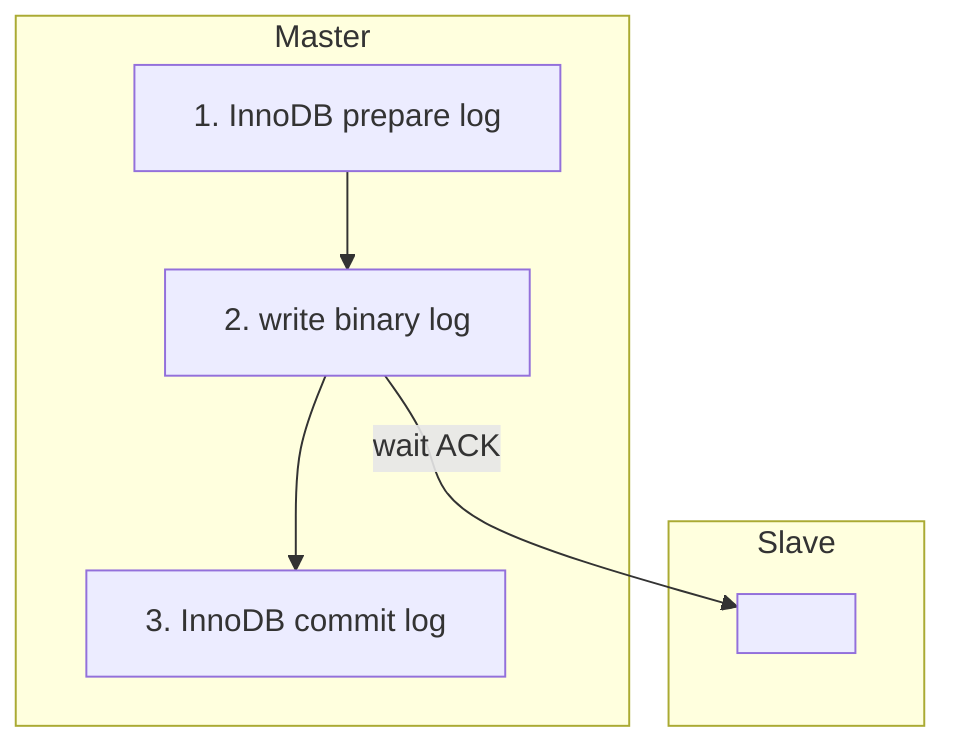
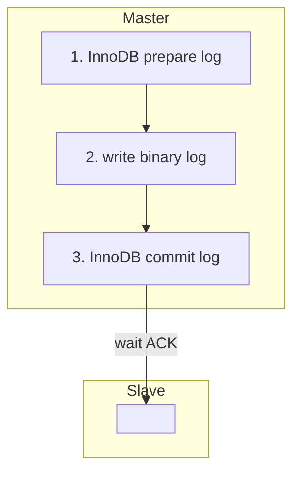
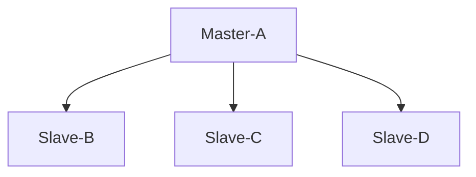
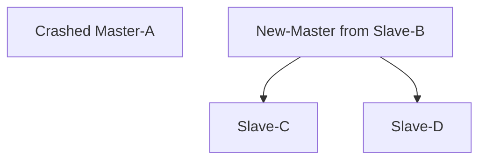
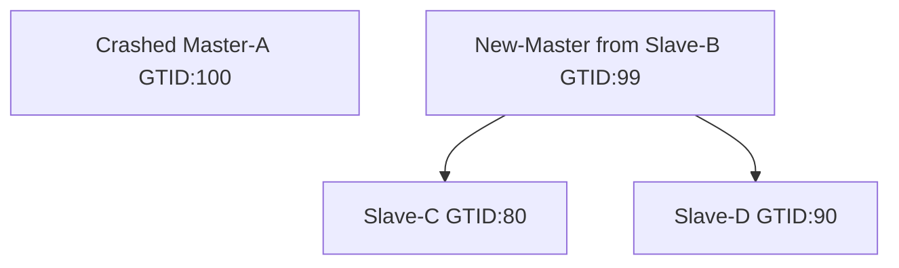

# 半同步复制原理

半同步设置可以设为两种半同步复制，一种叫 AFTER_SYNC，一种叫 AFTER_COMMIT

## AFTER_SYNC（推荐使用）

MySQL 5.7 默认是用 AFTER_SYNC

    (root@127.0.0.1:3307) [a]> show variables like 'rpl%';
    +-------------------------------------------+------------------+
    | Variable_name                             | Value            |
    +-------------------------------------------+------------------+
    | rpl_semi_sync_master_enabled              | ON               |
    | rpl_semi_sync_master_timeout              | 1000000000000000 |
    | rpl_semi_sync_master_trace_level          | 32               |
    | rpl_semi_sync_master_wait_for_slave_count | 1                |
    | rpl_semi_sync_master_wait_no_slave        | ON               |
    | rpl_semi_sync_master_wait_point           | AFTER_SYNC       |    <--AFTER_SYNC
    | rpl_semi_sync_slave_enabled               | ON               |
    | rpl_semi_sync_slave_trace_level           | 32               |
    | rpl_stop_slave_timeout                    | 31536000         |
    +-------------------------------------------+------------------+
    9 rows in set (0.00 sec)

AFTER_SYNC 的意思是一次提交的时候，当我写完二进制日志之后，但是这个事务并没有提交 slave 就要接收到二进制日志

如图也就是这个事务在提交的时候，第 3 步并没有执行完这个事务还没有提交成功，但是在写二进制日志写完之后就需要确保至少一个 slave 接收到了日志

看个例子：

    (root@127.0.0.1:3307) [a]> create database test;
    Query OK, 1 row affected (0.02 sec)

    (root@127.0.0.1:3307) [a]> use test;
    Database changed
    (root@127.0.0.1:3307) [test]> create table a (a int primary key);
    Query OK, 0 rows affected (0.03 sec)

    (root@127.0.0.1:3307) [test]> set global rpl_semi_sync_master_timeout = 1000000000000000;   # 防止超时切异步
    Query OK, 0 rows affected (0.00 sec)

    (root@127.0.0.1:3308) [(none)]> stop slave io_thread;   # 从机上停掉slave io_thread
    Query OK, 0 rows affected (0.00 sec)

    (root@127.0.0.1:3307) [test]> insert into a values(1);
    |   # 被阻塞住了，因为没有一个 slave 接收

    (root@127.0.0.1:3307) [(none)]> select * from test.a;
    Empty set (0.00 sec)    # 现在看不到数据因为没有提交就被卡住了

MySQL 5.7 把 AFTER_SYNC 这种模式称为 lossless 无损复制，能够保证主从数据的严格一致

## AFTER_COMMIT（5.7以后基本上用不到了）

将主机上面改成 AFTER_COMMIT 模式：

    (root@127.0.0.1:3307) [a]> set global rpl_semi_sync_master_wait_point = 'after_commit';
    Query OK, 0 rows affected (0.00 sec)

这时候的等待不是在 2 执行完之后等待，而是 3 执行完之后才等待，3 执行完之后再等待意味着执行完的记录是可见的，因为这个记录已经结束了

继续上面的例子：

    (root@127.0.0.1:3308) [(none)]> stop slave io_thread;
    Query OK, 0 rows affected (0.00 sec)

    (root@127.0.0.1:3307) [test]> insert into a values(1);
    |   # 又被阻塞住了，因为没有一个 slave 接收

    (root@127.0.0.1:3307) [(none)]> select * from test.a;
    +---+
    | a |
    +---+
    | 1 |
    | 2 |
    +---+
    2 rows in set (0.00 sec)  # 这条记录变得可见了，因为是提交完事务已经结束了才等待，说明数据已经插进去了

这时候的等待不是在 2 执行完之后再等待，而是 3 执行完之后再等待，3 执行完之后才等待意味着上面例子中的记录就变得可见了

## 参数

半同步复制切换到异步复制只需要调整一个参数：

    mysql> set global rpl_semi_sync_master_enabled = 0;

### 测试命令

    $ sysbench --test=/mdata/sysbench/sysbench/tests/db/update_non_index.lua --oltp-tables-count=2 --oltp-table-size=100000 --oltp-dist-res=95 --mysql-host=127.0.0.1 --mysql-user=root --mysql-password=Abc123__ --mysql-port=3307 --num-threads=16 --max-request=0 --max-time=30000 --report-interval=3 run

### rpl_semi_sync_master_wait_for_slave_count

半同步复制是保证日志至少有一个 slave 接收到就可以了，但通过这个参数可以设置有多少个 slave 都接收到日志事务才能提交

一般都是设成从机数量除以 2 即可，比如一主四从那么设置成 2 就可以了

## 性能影响 AFTER_SYNC 模式

无损的半同步复制的性能并不会像大家想象的那样下降非常多

性能下降多少第一点是和网络延时有关系的，百兆和千兆网的差距就非常明显

第二点是和事务的写入量有关的，比如你的业务很多都是读取只有小部分的是插入的话或者更新或者 DML 操作的话，其实半同步复制带来的性能下降是并不明显的

所以强烈建议在生产环境中开启半同步复制，在 MySQL 5.7 场景之下一定要打开 AFTER_SYNC 这个选项，5.7 不需要 GR 就可以保证主从数据的一致性只不过 GR 可以全自动选主，而用半同步复制来做的话外面还要再加一个 MHA，这两个方案各有优缺点

### select.lua 测试

因为是只读测试不会产生二进制日志，所以异步和半同步无损复制的性能没有任何区别

### oltp.lua 测试

18 条 SQL 组成，其中 14 条是 SELECT，4 条是 UPDATE

这种情况异步和半同步无损复制的性能其实是差不多的

### update_non_index.lua 测试

这种情况异步和半同步无损复制的性能差距其实也不大，10% 左右

# GTID

之前做的 MySQL 复制都是基于 (filename,pos) 来确定同步点的，比如 change master 的时候用 MASTER_LOG_FILE、MASTER_LOG_POS 才能知道同步点的位置是什么，但是通过 (filename,pos) 来进行连接的话会存在以下这种情况：

假设有以下架构

当 Master-A 发生宕机了，我要进行切换的时候就做不到了，这时需要重建复制关系的时候如果将 Slave-B 作为新的 master，就需要在另外两个从 Slave-C 和 Slave-D 上执行 change master 操作切换到新的主机  New-Master from Slave-B 上面

这时候就会存在问题，此时从上面记录的位置是已经宕机 Master-A 的 (filename,pos)，现在 change master 要切换到 New-Master from Slave-B 上，New-Master from Slave-B 的 (filename,pos) 和前面宕机 Master-A 的 (filename,pos) 是没有对应关系的，文件名、文件大小、pos 都可以是完全不一样的，所以是很难直接去 change master 的

Slave 保存的是原 Master 上的 (filename,pos)，所以无法直接指向新 Master 上的 (filename,pos)，可以通过像 MHA 这样的工具的 relaylog 来判断

## GTID 概念

简单来说 GTID 是一个全局事务的标识， 有了 GTID 就能标识当前事务的 GTID 号是多少，而且这个 GTID 在所有的机器上都是统一的

现在假设 Crashed Master-A GTID 执行到了 100 这个事务，New-Master 执行到的是 99，Slave-C 是 80，Slave-D 是 90

那么 change master 的时候就再也不需要指定 (filename,pos)，而只需要指定从某个 GTID 号把日志拉过来就可以了，因为 GTD 在所有机器之间是全局唯一的，而不像 (filename,pos) 是基于某个数据库实例而不是全局的

## 使用 GTID 代替 (filename,pos)

uuid + transactionid

要开启 GTID，配置文件中必须包含以下参数 my.cnf：

    # Replication
    ...
    logbin
    log_slave_updates = 1
    gtid_mode = on                # new 
    enforce_gtid_consistency = 1  # new
    ...

主从都配置好后就都是 GTID 模式了：

    (root@127.0.0.1:3307) [test]> show variables like 'gtid%';
    +----------------------------------+-----------+
    | Variable_name                    | Value     |
    +----------------------------------+-----------+
    | gtid_executed_compression_period | 1000      |
    | gtid_mode                        | ON        |    <--表示已开启GTID模式
    | gtid_next                        | AUTOMATIC |
    | gtid_owned                       |           |
    | gtid_purged                      |           |
    +----------------------------------+-----------+
    5 rows in set (0.00 sec)

    (root@127.0.0.1:3308) [test]> show variables like 'gtid%';
    +----------------------------------+-----------+
    | Variable_name                    | Value     |
    +----------------------------------+-----------+
    | gtid_executed_compression_period | 1000      |
    | gtid_mode                        | ON        |    <--表示已开启GTID模式
    | gtid_next                        | AUTOMATIC |
    | gtid_owned                       |           |
    | gtid_purged                      |           |
    +----------------------------------+-----------+
    5 rows in set (0.00 sec)

查看当前 MySQL 实例的 server_uuid 是多少，不同实例的不一样

    (root@127.0.0.1:3307) [(none)]> show variables like 'server_uuid';
    +---------------+--------------------------------------+
    | Variable_name | Value                                |
    +---------------+--------------------------------------+
    | server_uuid   | 05c0bb9c-e635-11ec-8775-0242ac110002 |
    +---------------+--------------------------------------+
    1 row in set (0.00 sec)

插入一条数据，然后查看当前的 GTID 是多少：

    (root@127.0.0.1:3307) [test]> insert into a values(3);
    Query OK, 1 row affected (0.00 sec)

    (root@127.0.0.1:3307) [test]> show master status;
    +------------+----------+--------------+------------------+----------------------------------------+
    | File       | Position | Binlog_Do_DB | Binlog_Ignore_DB | Executed_Gtid_Set                      |
    +------------+----------+--------------+------------------+----------------------------------------+
    | bin.000009 |      406 |              |                  | 05c0bb9c-e635-11ec-8775-0242ac110002:1 |
    +------------+----------+--------------+------------------+----------------------------------------+
    1 row in set (0.00 sec)

    (root@127.0.0.1:3307) [test]> insert into a values(4);
    Query OK, 1 row affected (0.01 sec)

    (root@127.0.0.1:3307) [test]> show master status;
    +------------+----------+--------------+------------------+------------------------------------------+
    | File       | Position | Binlog_Do_DB | Binlog_Ignore_DB | Executed_Gtid_Set                        |
    +------------+----------+--------------+------------------+------------------------------------------+
    | bin.000009 |      658 |              |                  | 05c0bb9c-e635-11ec-8775-0242ac110002:1-2 |  <-- 这里1-2表示了开机记录的事务范围，每个事务都会+1
    +------------+----------+--------------+------------------+------------------------------------------+
    1 row in set (0.00 sec)

注意如果是做了双主的架构，一旦在另一个主里面执行了 DML 操作，Executed_Gtid_Set 里会出现多个，一个是当前的 server-uuid:1，一个是同步的 server-uuid:当前事务号

如果打开了 gtid_mode 后，change master 的时候不用再打 filename 和 position 了，通过下面的步骤在从机上开启 GTID：

    (root@127.0.0.1:3309) [(none)]> stop slave;
    Query OK, 0 rows affected (0.00 sec)

    (root@127.0.0.1:3308) [(none)]> CHANGE MASTER TO MASTER_HOST='127.0.0.1',MASTER_PORT=3307,MASTER_USER='rpl',MASTER_PASSWORD='Abc123__',MASTER_AUTO_POSITION = 1;
    Query OK, 0 rows affected, 2 warnings (0.01 sec)

    (root@127.0.0.1:3309) [(none)]> start slave;
    Query OK, 0 rows affected (0.00 sec)

    (root@127.0.0.1:3308) [test]> show slave status\G
    *************************** 1. row ***************************
    ...
                Executed_Gtid_Set: 05c0bb9c-e635-11ec-8775-0242ac110002:1-2
                    Auto_Position: 1    <--已开启Auto_Position
            Replicate_Rewrite_DB:
    ...
    1 row in set (0.00 sec)

在 MySQL 5.6 版本中 GTID 这个模式用得比较少，最重要的原因是 GTID 要么开要么不开，不能做到同一个非 GTID 的模式升级到 GITD 模式，而 MySQL 5.7 版本开始是可以在线升级到 GTID 模式的

### 在线升级 GITD 的方法 MySQL 5.7

如果一开始的时候 gtid_mode 是 OFF 的，需要将 gtid_mode 按照 OFF_PERMISSIVE <-> ON_PERMISSIVE <-> ON 的顺序设置即可：

    (root@127.0.0.1:3309) [(none)]> set global gtid_mode = OFF_PERMISSIVE;
    Query OK, 0 rows affected (0.00 sec)

    (root@127.0.0.1:3309) [(none)]> set global gtid_mode = ON_PERMISSIVE;
    Query OK, 0 rows affected (0.00 sec)

    (root@127.0.0.1:3309) [(none)]> set global gtid_mode = ON;
    Query OK, 0 rows affected (0.00 sec)

这些参数的意思：

    OFF               彻底关闭GTID，如果关闭状态的从库接收到带GTID的事务，则复制中断
    OFF_PERMISSIVE    可以认为是关闭GTID前的过渡阶段，主库在设置成该值后不再生成GTID，从库在接收到GTID和不带GTID的事务都可以容忍
                      主库在关闭GTID时，执行事务会产生一个Anonymous_Gtid事件，会在从库执行：
                      SET @@SESSION.GITD_NEXT='ANONYMOUS'
                      从库在执行匿名事务时，就不会去尝试生成本地GTID了
    ON_PERMISSIVE     可以认为是打开GTID前的过渡阶段，主库在设置成该值后就会开始产生GTID，同时从库依然容忍带GTID和不带GTID的事务
    ON                完全打开GTID，如果打开状态的从库接收到不带GTID的事务，则复制中断

主库先从 OFF 设置成 ON_PERMISSIVE 再设置为 ON

从库先设置成 ON_PERMISSIVE 可以同时接收带 GTID 和不带 GTID 的二进制日志，等同步到都是 GTID 的日志之后，再完全打开成 ON 就可以了

降级的话就是 OFF_PERMISSIVE <-> OFF

**GITD 是很多高可用的基础，所以强烈建议打开 GTID 功能**