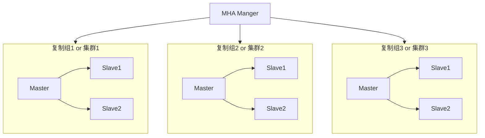

# MySQL 高可用解决方案和 MHA 集群架构

## 高可用与高可靠的区别

高可用指的是一种处理能力，用来处理故障的能力，也就是说如果发生了故障，包括 MySQL 故障、操作系统故障、硬件故障，这时高可用就是用来维护系统活跃度的一种能力

要求的是一种可用性，如果 A 这台机器宕了，B 这台机器能顶上那么就是有可用性，如果顶不上就是没有可用性

* 高可用
  * 维护系统可用性
  * 强调的是系统的可用性
  * 简单来说，避免单点的存在
  * 度量单位：系统每年的宕机时间
  * 度量标准：99%、99.9%、99.95%、99.99%、99.999%
  * 适用场景：对于可用性要求较高的互联网行业

一年内宕机率计算对照表：

    9         9.       9         9        9       %
    35 days   4 days   8 hours   50 mins  5 mins

* 高可靠
  * 定义非常广泛，甚至没有标准的定义
  * 从侠义的数据库角度来看，就是数据是否丢失
  * 从MySQL复制的角度来看，就是数据是否丢失
  * 度量单位：数据是否丢失
  * 度量标准：任何宕机情况下，数据不丢失
  * 适用行业：对数据一致性要求高的互联网以及传统行业
    * 从广义上看，其实**高可靠基于高可用基础上**
    * 即要**保证数据不丢失**又要保证**服务的连续可用性**

高可用与高可靠的对比

|          | 高可用                                                     | 高可靠                                                 |
| -------- | ---------------------------------------------------------- | ------------------------------------------------------ |
| 定义     | 保证系统可用性                                             | 保证系统一致性                                         |
| 目的     | 避免单点造成的服务不可用                                   | 避免数据丢失                                           |
| 度量单位 | 每秒宕机时间                                               | 数据是否丢失                                           |
| 适用行业 | 对可用性要求高、数据一致性弱的行业，如：博客、微博、微信等 | 对数据一致性要求高的行业，如：银行、电信、互联网金融等 |

## MySQL 高可用解决方案

* 业界的解决方案较为成熟
* 简单总结来说Linux VIP(Virtual IP Address) + MySQL Replication
* 如果需要做负载均衡，用MHA来做切换，前端配置LVS来做读写分离
  * 但是并不推荐作为OLTP应用的读可扩展性方案
  * 不要用数据库去做读写分离，因为延时很大性能而且很差
  * 真正推荐的是Redis等缓存方案
* 业界方案 
  * Keepalived + Replication
  * MHA

## MySQL 高可靠解决方案

其实在 MySQL 5.7 版本之前，其实 MySQL 本身没有一个所谓的高可靠的方案技能保证可用性又能保证一致性

* MySQL辅助存在很多“坑”
  * 数据一致性无法保证
  * 即使是所谓的semi-sync复制
  * 复制配置有很多技巧，需要丰富的调优经验
* 目前最简单的方案是共享存储
  * 设备的加个和MySQL数据库的定位是否匹配
    * 非常贵，有钱就是任性？
  * 共享存储本身是一个单点
  * failover后standby的服务器没有预热
* 社区的另一个方案：Galera
  * 实现思想非常复杂
  * 非官方的实现方案
  * 关键：没有实际大生产环境成功经验

## MHA 解决方案

通常来说 MHA 的解决方案就是一主一从，一主两从或者一主三从，把这几个叫做高可用组或者高可用集群，这个集群对客户端来说对外只暴露了一个虚拟 IP，应用程序去操作数据库走得都是这个 VIP

### 创建虚拟 IP

    $ ifconfig
    eth0: flags=4163<UP,BROADCAST,RUNNING,MULTICAST>  mtu 1500
            inet 172.20.0.2  netmask 255.255.0.0  broadcast 172.20.255.255
            ether 02:42:ac:11:00:02  txqueuelen 0  (Ethernet)
            RX packets 15299  bytes 13534523 (12.9 MiB)
            RX errors 0  dropped 0  overruns 0  frame 0
            TX packets 9707  bytes 472309 (461.2 KiB)
            TX errors 0  dropped 0 overruns 0  carrier 0  collisions 0

    ...
    
    # root @ 9fc028750734 in / [14:18:28] C:1
    $ ifconfig eth0:0 172.20.0.188

    # root @ 9fc028750734 in / [14:18:48]
    $ ifconfig
    eth0: flags=4163<UP,BROADCAST,RUNNING,MULTICAST>  mtu 1500
            inet 172.20.0.2  netmask 255.255.0.0  broadcast 172.20.255.255
            ether 02:42:ac:11:00:02  txqueuelen 0  (Ethernet)
            RX packets 15353  bytes 13536791 (12.9 MiB)
            RX errors 0  dropped 0  overruns 0  frame 0
            TX packets 9761  bytes 474577 (463.4 KiB)
            TX errors 0  dropped 0 overruns 0  carrier 0  collisions 0

    # 新创建的虚拟IP，实际的IP是绑定在172.20.0.2上面的
    eth0:0: flags=4163<UP,BROADCAST,RUNNING,MULTICAST>  mtu 1500  
            inet 172.20.0.188  netmask 255.255.0.0  broadcast 172.20.255.255
            ether 02:42:ac:11:00:02  txqueuelen 0  (Ethernet)
    ...

一开始虚 IP 是绑定在一个 MySQL 实例上面的，假设现在有一个一主两从的集群，其中 master 的 IP 是 .100，两台从的 IP 分别是 .200 和 .300，虚拟 IP 是 .80 是绑定在 .100 IP 这台 master 主机上面的

高可用软件 MHA 可以用来监控高可用集群，MHA 会定期去检测 master 和 slave，如果 master 宕了 MHA 就会把虚 IP 飘到一台新的 slave 上面

比如说现在 IP .100 的 master 宕机了，.80 这个虚 IP 就飘到其中的某台机器比如说 .200 的机器上，对业务来说访问的依旧是 .80 这个 IP，业务不需要做任何的改动，这就叫做高可用

### MHA 如何监控 MySQL 是否有宕机

MHA 会定期去 master 主机上面去做一个 SELECT 或者 INSERT 操作，如果不能执行 SELECT 和 INSERT 操作的话 MHA 并不直接会认为 master 宕机了，因为这时候可能的一种情况只是我跑 MHA 的服务器和 master 连接出现了问题

所以 MHA 的机制是如果这边不能对 master 进行 SELECT 或者 INSERT 的时候，MHA会先后登录到各个 slave，然后通过各个 slave 都再去探测一次，如果这些返回的都是不能访问的话 MHA 才认为 master 这台服务器宕机了

这个操作叫做二次探测，如果二次探测也是失败的话，就会做一个叫做 failover 的操作，进行故障切换把 VIP 飘过去从 slave 里面选一个最新的从把它升级为主，然后重建复制关系

MHA 有一个很大的缺陷，MHA 访问 master 和 slave 走得都是一个 SSH 的协议，也就是说 MHA 是通过登录到 slave 然后再去访问 master 的，所以有一个限制就是 MHA 和这些集群里的节点之间是需要通过 SSH 打通的是不需要使用密码进行登录的，这对于网络要求来说可能就是不能接受的了

所以对 MHA 的改造无非就是说将原来的每次都通过 SSH 连接去执行一个命令，优化成在每一个 MySQL 实例上去跑一个代理，然后 MHA 要发命令的话不是直接 SSH 过去执行命令，而是发个一个命令到代理上比如要做高可用切换了检查一下 master 是否活着

很难说 MHA 是能够解决脑裂问题的，但是 MHA 有二次探测机制，所以可以认为基本上是没有脑裂问题的，如果 MHA 和从机都访问不了主机，其实就可以认为大部分的节点都访问不了主机，这时候就可以进行切换，但是从本身机制上来说是没有完全解决脑裂的，而且基于 VIP 虚拟 IP 这种机制来说的话，或多或少都是会存在一些问题的，只能说大部分情况下避免了

真正解决脑裂的是 [MGR](https://dev.mysql.com/doc/refman/8.0/en/group-replication.html)，MGR 是在 MySQL 内部解决的

## MHA 的搭建

这个项目其实已经不活跃了，也就不再推荐使用了，Centos8 下面装起来也有问题

了解一下 MHA 的过往和历史就好了

## 主从读写分离方案

读写分离是指可以将读的请求都分发 slave 上面而不是在 master 上面，读写分离有一个前置条件是主从延时不能很大，也就是说读取的时候到底读的数据的延迟大到能不能接受

如果要实现读写分离，就要能容忍从上面是有延时的，就比如如果用于注册的服务器是读写分离的架构，用户注册完写 master 之后，去登录读 slave 的时候告诉你用户名还没注册，用户发现后再去注册提示你用户名已注册

要做读写分离 MySQL 版本至少要在 5.7 有以上，因为在 MySQL 5.7 版本上主从延迟已经非常小了，5.7 的基于组提交的多线程复制方案虽然非常好，但是还是会有延时

可能只有在 MySQL 8.0 才能真正解决这个问题，8.0 的多线程复制用了基于主键的多线程复制，基于主键的并行复制并发度可以更高，即使主是单线程运行的从也可以并行执行，一个事务里面如果更新的主键和其他的另外一个事务的主键是没有任何冲突的那么大家都可以并行执行，所以并发度可以提高非常多

### 基于 LVS 搭建读写分离

LVS 是通过 Keepalived 来实现的

#### Keepalived

Keepalived 是一个用 C 写的一个路由软件，主要目的是用来实现负载均衡和高可用，它是基于 LVS 这种机制来实现的 4 层负载均衡，性能是非常非常不错的基本没有损失

Keepalived 的高可用是通过 VRRP 协议来实现的，需要注意的是 VRRP 本身是会脑裂的，所以如果通过 Keepalived 去做 MySQL 的高可用就需要知道 Keepalived 本身是存在脑裂，还需要其他的一些辅助软件去避免这样的一个问题，所以其实不太推荐 Keepalived 去做 MySQL 的一个高可用，但是可以通过 Keepalived 的另外一个功能用来做读写分离

前面的例子中 .88 的 VIP 可以把它叫做 write_vip 或者 master_vip，如果再给一个 .89 的 VIP 叫做 read_vip，应用程序可以在 .88 进行读写，在 .89 只能读而且可以发到 slave 上，这个读写分离的方案对应用程序来说不是透明的，也就是说应用程序需要显示的知道有一个读 IP 和 写 IP

用中间件去实现读写分离也是可以的，但是如果是在单个高可用组里面去做读写分离用中间件可能太重了没有必要，另外中间件本身也没有什么很好的中间件，所以尽量用 Keepalived 或者是 MySQL Router 去实现读写分离，这些机制本质上来说就是会给你两个 IP，一个读的 IP，一个配到 salve 上的写的 IP

#### 创建 3 个 MySQL 容器 已经包含 MySQL 和 Keepalived 和相关软件

Docker 创建自定义网络：

    $ docker network create --subnet=172.20.0.0/32 myle0

master 容器：

    $ docker run --privileged -idt --name mysql1 --hostname mysql1 --network myle0 --ip 172.20.0.10 -p 3306:3306 -v D:/wmnt/:/wmnt my-mysql:v1.0 /usr/sbin/init

slave 容器：

    $ docker run --privileged -idt --name mysql2 --hostname mysql2 --network myle0 --ip 172.20.0.11 -v D:/wmnt/:/wmnt my-mysql:v1.0 /usr/sbin/init

    $ docker run --privileged -idt --name mysql3 --hostname mysql3 --network myle0 --ip 172.20.0.12 -v D:/wmnt/:/wmnt my-mysql:v1.0 /usr/sbin/init

在主从上都创建 rpl 用户：

    # 创建用户
    (root@127.0.0.1:3307) [(none)]> create user rpl@'%' identified by 'Abc123__';
    Query OK, 0 rows affected (0.00 sec)

    # 授予复制权限
    (root@127.0.0.1:3307) [(none)]> grant replication slave on *.* to rpl@'%';
    Query OK, 0 rows affected (0.00 sec)

注意三个容器上的 mysql 也需要全部启动：

    $ /etc/init.d/mysql.server restart

#### Keepalived 安装

    $ yum install keepalived

修改配置文件：

    $ cp /etc/keepalived/keepalived.conf /etc/keepalived/keepalived.conf.old

    $ vim /etc/keepalived/keepalived.conf
    ! Configuration File for keepalived
    
    global_defs {
      router_id LVS_MASTER
    }
    
    vrrp_instance MySQL_LB_BACKUP {
      state BACKUP
      interface eth0
      virtual_router_id 199
      priority 120
      nopreempt
      advert_int 1
      authentication {
        auth_type PASS
        auth_pass 1111
      }
      virtual_ipaddress {
        172.20.0.199
      }
    }
   
    virtual_server 172.20.0.199 3306 {
      delay_loop 6
      lb_algo wrr
      lb_kind DR
      nat_mask 255.255.255.0
      #persistence_timeout 50
      protocol TCP
   
      real_server 172.20.0.3 3306 {
        weight 1
        TCP_CHECK {
          connect_timeout 3
          nb_get_retry 3
          delay_before_retry 3
          connect_port 3306
        }
      }
      real_server 154.211.14.121 3306 {
        weight 1
        TCP_CHECK {
          connect_timeout 3
          nb_get_retry 3
          delay_before_retry 3
          connect_port 3306
        }
      }
    }

需要注意的是 DR 模式下 real_server 的端口需要和 virtual_server 的保持一致

一些参数说明：

    lb_algo             轮询算法，默认是rr，通常会改成wrr基于weight权重进行轮询
    protocol            检测协议
    connect_timeout     连接超时时间
    delay_before_retry  每个几秒钟会去检测一下
    connect_port 3306   检测端口号是多少
    weight              权重设置，比如全部是1，将其中的一个改为2，那么往权重为2发送的请求会变成其他的2倍

启动服务：

    $ systemctl start keepalived.service

    $ systemctl enable keepalived.service
    Created symlink /etc/systemd/system/multi-user.target.wants/keepalived.service → /usr/lib/systemd/system/keepalived.service.

    $ systemctl status keepalived.service
    ● keepalived.service - LVS and VRRP High Availability Monitor
      Loaded: loaded (/usr/lib/systemd/system/keepalived.service; enabled; vendor preset: disabled)
      Active: active (running) since Fri 2022-07-01 23:11:46 CST; 9s ago
    Main PID: 81309 (keepalived)

查看虚拟 IP：

    $ ip a
    1: lo: <LOOPBACK,UP,LOWER_UP> mtu 65536 qdisc noqueue state UNKNOWN group default qlen 1000
        link/loopback 00:00:00:00:00:00 brd 00:00:00:00:00:00
        inet 127.0.0.1/8 scope host lo
          valid_lft forever preferred_lft forever
    2: tunl0@NONE: <NOARP> mtu 1480 qdisc noop state DOWN group default qlen 1000
        link/ipip 0.0.0.0 brd 0.0.0.0
    3: sit0@NONE: <NOARP> mtu 1480 qdisc noop state DOWN group default qlen 1000
        link/sit 0.0.0.0 brd 0.0.0.0
    20: eth0@if21: <BROADCAST,MULTICAST,UP,LOWER_UP> mtu 1500 qdisc noqueue state UP group default
        link/ether 02:42:ac:14:00:0a brd ff:ff:ff:ff:ff:ff link-netnsid 0
        inet 172.20.0.10/24 brd 172.20.0.255 scope global eth0
          valid_lft forever preferred_lft forever
        inet 172.20.0.199/32 scope global eth0        <--表示x.x.x.199的虚拟IP生效了
          valid_lft forever preferred_lft forever

    $ ipvsadm -Ln
    IP Virtual Server version 1.2.1 (size=4096)
    Prot LocalAddress:Port Scheduler Flags
      -> RemoteAddress:Port           Forward Weight ActiveConn InActConn
    TCP  172.20.0.199:3306 wrr
      -> 172.20.0.11:3306             Route   1      0          0         <--转发到x.x.x.11的IP的3306端口上
      -> 172.20.0.12:3306             Route   1      0          0         <--转发到x.x.x.12的IP的3306端口上
    
    # 看不到的话重启以下keepalived
    $ systemctl restart keepalived.service

到一台从机上去 ping 一下这个虚拟 IP 试试是 OK 的：

    $ ping 172.20.0.199
    PING 172.20.0.199 (172.20.0.199) 56(84) bytes of data.
    64 bytes from 172.20.0.199: icmp_seq=1 ttl=64 time=0.053 ms
    64 bytes from 172.20.0.199: icmp_seq=2 ttl=64 time=0.040 ms
    64 bytes from 172.20.0.199: icmp_seq=3 ttl=64 time=0.040 ms

远程查看 MySQL 是否在虚拟 IP 端口上运行：

    $ telnet 172.20.0.199 3306
    Trying 172.20.0.199...
    telnet: connect to address 172.20.0.199: Connection refused

如果在主机上把 keepalived 关掉的话：

    $ systemctl stop keepalived.service

在从机上就 ping 不通了：

    $ ping 172.20.0.199
    PING 172.20.0.199 (172.20.0.199) 56(84) bytes of data.
    From 172.20.0.2 icmp_seq=1 Redirect Host(New nexthop: 199.0.20.172)
    From 172.20.0.2 icmp_seq=2 Redirect Host(New nexthop: 199.0.20.172)
    From 172.20.0.2 icmp_seq=3 Redirect Host(New nexthop: 199.0.20.172)

再次在主机上启动 keepalived：

    $ systemctl start keepalived.service

#### 遇到的问题

在做 keepalived 的时候会遇到这样的问题，就是 keepalived 都配好了，然后用 mysql -h172.20.0.199 -urpl -p"Abc123__" 去访问会发现访问不过去，而这时候通过 ip a 查看虚拟 IP 都还在

这个问题的原因是不仅需要配置 keepalived 的虚 IP，另外在每台接收转发的机器上还需要做一个配置创建一个本地回路的网卡，这个网卡是需要绑定 keepalived 中的虚 IP 的，并且配置一些网络的配置，这样才能接收转发过来的网络包 

编写 realserver.sh 脚本，脚本内容：

    #!/bin/bash
    VIP=172.20.0.199    # 绑定keepalived中的虚IP 

    case "$1" in
    start)
      ifconfig lo:0 $VIP netmask 255.255.255.255 broadcast $VIP
      /sbin/route add -host $VIP dev lo:0
      echo "1" >/proc/sys/net/ipv4/conf/all/arp_ignore
      echo "2" >/proc/sys/net/ipv4/conf/all/arp_announce
      sysctl -p >/dev/null 2>&1
      echo "RealServer Start OK"
      ;;
    stop)
      ifconfig lo:0 down
      route del $VIP >/dev/null 2>&1
      echo "0" >/proc/sys/net/ipv4/conf/all/arp_ignore
      echo "0" >/proc/sys/net/ipv4/conf/all/arp_announce
      echo "RealServer Stoped"
      ;;
      *)
      echo "Usage: $0 {start|stop}"
      exit 1
    esac
    exit 0

在每个从机上使用 realserver.sh 这个脚本：

    $ ./realserver.sh start

这时候就可以在一台另外的机器上(非主从机器)通过虚 IP 的 3306 端口访问 MySQL：

    $ mysql -h172.20.0.199 -urpl -p"Abc123__"
    mysql: [Warning] Using a password on the command line interface can be insecure.
    Welcome to the MySQL monitor.  Commands end with ; or \g.
    Your MySQL connection id is 4
    Server version: 5.7.37-log MySQL Community Server (GPL)

    Copyright (c) 2000, 2022, Oracle and/or its affiliates.

    Oracle is a registered trademark of Oracle Corporation and/or its
    affiliates. Other names may be trademarks of their respective
    owners.

    Type 'help;' or '\h' for help. Type '\c' to clear the current input statement.

    (rpl@172.20.0.199:3306) [(none)]> show variables like 'hostname';
    +---------------+--------+
    | Variable_name | Value  |
    +---------------+--------+
    | hostname      | mysql2 |
    +---------------+--------+
    1 row in set (0.00 sec)

以这种方式，每次访问的时候转发到的机器可能都是不一样的，这就是所说的负载均衡：

    $ mysql -h172.20.0.199 -urpl -p"Abc123__" -e"show variables like 'hostname';"
    mysql: [Warning] Using a password on the command line interface can be insecure.
    +---------------+--------+
    | Variable_name | Value  |
    +---------------+--------+
    | hostname      | mysql2 |  <--
    +---------------+--------+

    $ mysql -h172.20.0.199 -urpl -p"Abc123__" -e"show variables like 'hostname';"
    mysql: [Warning] Using a password on the command line interface can be insecure.
    +---------------+--------+
    | Variable_name | Value  |
    +---------------+--------+
    | hostname      | mysql3 |  <--
    +---------------+--------+

需要注意的是 Keepalived 在启动的时候会对 real_server 去做健康检查 Keepalived_healthcheckers，如果配置中的 IP:PORT 没法 Ping 通，就会把移除相应的服务 Removing service，所以当使用 ipvsadm -Ln 命令查看时，如果发现预期和配置文件不符的话，就要去检查对应 IP 的机器上对应端口的服务时候已经运行

而且如果停掉的服务如果后面启动了，也会重新加进来，比如下面这样：

    $(172.20.0.11) /etc/init.d/mysql.server stop
    Shutting down MySQL.. SUCCESS!

    $(172.20.0.10) ipvsadm -Ln
    IP Virtual Server version 1.2.1 (size=4096)
    Prot LocalAddress:Port Scheduler Flags
      -> RemoteAddress:Port           Forward Weight ActiveConn InActConn
    TCP  172.20.0.199:3306 wrr
                                                                            <--11上的MySQL服务停止后到11的转发被自动移除了
      -> 172.20.0.12:3306             Route   1      0          0

    $(172.20.0.11) /etc/init.d/mysql.server start
    Starting MySQL. SUCCESS!

    $(172.20.0.10) ipvsadm -Ln
    IP Virtual Server version 1.2.1 (size=4096)
    Prot LocalAddress:Port Scheduler Flags
      -> RemoteAddress:Port           Forward Weight ActiveConn InActConn
    TCP  172.20.0.199:3306 wrr
      -> 172.20.0.11:3306             Route   1      0          0           <--11上的MySQL服务重新启动后被自动加回来了
      -> 172.20.0.12:3306             Route   1      0          0

### 配置额外的 keepalived

keepalived 是一个单点，所以可以通过把优先级设得不一样，再配出一个 keepalived：

    $ vim /etc/keepalived/keepalived.conf
    vrrp_instance MySQL_LB_BACKUP {
      state BACKUP
      interface eth0
        virtual_router_id 199
        priority 100   <--修改这个优先级做到不同
        nopreempt
        ...
    }

这样一台 keepalived 服务器宕掉的话，虚拟 IP 就会飘到另外一台优先级次高的 keepalived 节点服务器

### 如何区分读和写请求

其实不用判断，因为连得如果是 MHA 的虚拟 IP 的话，这个 IP 表示的就是写的 IP，如果连的是 keepalived 的虚拟 IP 就是读的 IP，就等于是业务开发那边会拿到这 2 个 IP，一个是写的 IP 一个是读的 IP，所以 keepalived 能做的只是读 IP 的负载均衡

## MySQL Router 推荐使用

MySQL Router 是一个轻量级的中间件用来在你的应用和 MySQL 集群之间实现一个透明的路由，可以被使用在多个用户的场景之下，比如说高可用和读写分离

### MySQL Router 安装

    $ tar xvf ~/mysql-router-8.0.29-linux-glibc2.12-x86_64.tar.xz

    $ ln -s mysql-router-8.0.29-linux-glibc2.12-x86_64 mysql-router

    $ cd mysql-router

编写配置文件：

    $ vim /root/.mysqlrouter.ini
    [DEFAULT]
    logging_folder = /var/log/mysqlrouter
  
    [logger]
    level = INFO
  
    [routing:failover]            # 高可用
    bind_address = 172.20.0.10    # 运行mysql-router机器的IP，也可以用0.0.0.0
    bind_port = 7001              # 用来做高可用的IP的端口，这个用来写
    max_connections = 512         # 最大连接数
    mode = read-write             # 模式
    destinations = 172.20.0.11:3306,172.20.0.12:3306  # 服务器的遍历顺序，前面的挂了就依次读后面的
                                                      # 如果全部都访问不了，就永远访问不了，并不会像keepalived那样自动添加移除启动或者宕机了的服务器
  
    [routing:balancing]           # 负载均衡
    bind_address = 172.20.0.10     # 运行mysql-router机器的IP，也可以用0.0.0.0
    bind_port = 7002              # 用来做负载均衡的IP的端口，这个用来读
    #connect_timeout = 3
    max_connections = 512         # 最大连接数
    mode = read-only              # 模式
    destinations = 172.20.0.11:3306,172.20.0.12:3306  # 服务器的轮询顺序，前面的挂了就依次读后面的

    $ netstat -ntl
    Active Internet connections (only servers)
    Proto Recv-Q Send-Q Local Address           Foreign Address         State
    tcp        0      0 127.0.0.11:42711        0.0.0.0:*               LISTEN
    tcp        0      0 172.20.0.10:7001        0.0.0.0:*               LISTEN
    tcp        0      0 127.0.0.1:7002          0.0.0.0:*               LISTEN
    tcp6       0      0 :::3306                 :::*                    LISTEN

然后使用 MySQL 连接测试是否启用了负载均衡：

    # root @ mysql1 in ~ [12:08:54]
    $ mysql -h172.20.0.10 -urpl -p"Abc123__" -e"show variables like 'hostname'" -P 7002
    mysql: [Warning] Using a password on the command line interface can be insecure.
    +---------------+--------+
    | Variable_name | Value  |
    +---------------+--------+
    | hostname      | mysql2 |    <--这里会变化就表示成功
    +---------------+--------+

    # root @ mysql1 in ~ [12:08:55]
    $ mysql -h172.20.0.10 -urpl -p"Abc123__" -e"show variables like 'hostname'" -P 7002
    mysql: [Warning] Using a password on the command line interface can be insecure.
    +---------------+--------+
    | Variable_name | Value  |
    +---------------+--------+
    | hostname      | mysql3 |    <--这里会变化就表示成功
    +---------------+--------+

MySQL Router 的 failover 对于 read-write 模式来说对于高可用的切换还是不太成熟的

但是 MySQL Router 用来做读写分离的话又非常简单

需要注意的是 MySQL Router 是七层的负载均衡，而 keepalived 是四层的性能会好非常多